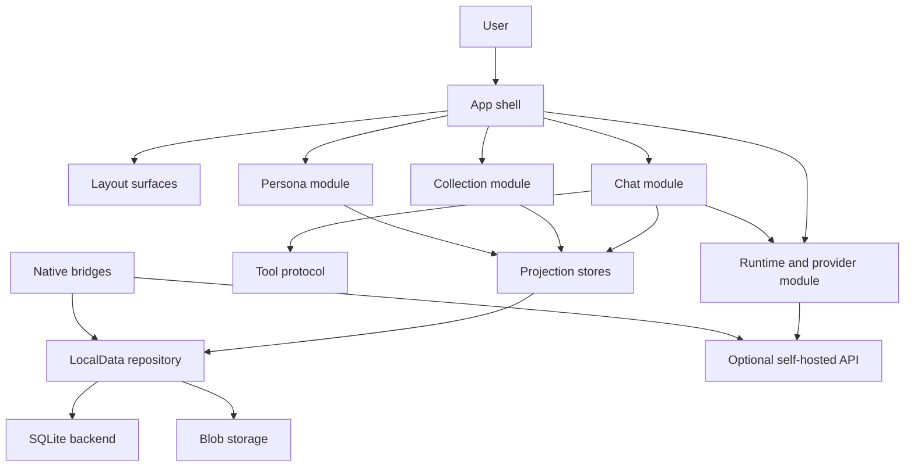

# Architecture Overview

Polaris is organized around shared product runtime code, explicit storage ownership, optional backend capability, and thin platform shells.

The important question is not "which screen does this appear on?" The important question is "which responsibility owns this fact or behavior?"

## High-Level Shape

## Main Runtime Areas

| Area | Main paths | Responsibility |
| --- | --- | --- |
| App shell | `src/ui/AppShell.tsx`, `src/app/shell/`, `src/ui/app-shell/` | First paint, top-level navigation, global sheets, app-level status surfaces |
| Layout surfaces | `src/app/shell/appLayoutSurface.ts`, `src/ui/app-shell/useAppLayoutSurface.ts`, `src/app/bootstrap/appLayoutSurfaceBootstrap.ts` | Phone/tablet/desktop arrangement, sidebar eligibility, explicit layout bootstrap facts |
| Chat | `src/ui/worlds/ChatWorld.tsx`, `src/app/chat/`, `src/engines/chat-api/` | Conversation lifecycle, request lifecycle, tool lifecycle, context use, message presentation |
| Collection | `src/ui/worlds/CollectionWorld.tsx`, `src/app/collection/` | Saved cards, assets, project workspace, import/export surfaces |
| Persona | `src/app/persona/`, `src/config/persona/personaBuilder.ts` | Collaborator identity, persona settings, long-lived reference heads |
| Runtime/provider | `src/engines/provider-runtime/`, `src/engines/request/`, provider settings UI | Provider profiles, model capability, direct/relay/native transport choices |
| Tool protocol | `src/engines/tool-protocol/`, tool executor code | Model-visible schemas, parsing, execution, result projection |
| LocalData | `src/engines/localData/`, domain row writers | Durable app facts, row state, commit validation, import and promotion invariants |
| Stores | `src/stores/` | UI/runtime projections for space, chat, collection, persona, and runtime |
| Server/selfhost | `api/`, `server/`, `workers/polaris-api/` | Optional API routes, shared relay validators, worker gateway, origin policy |
| Native bridges | `ios/`, `android/`, `src/native/` | Platform capabilities only |

## Dependency Direction

The preferred direction is:

1. Product modules read and write through domain contracts.
2. Domain contracts use LocalData for durable facts.
3. LocalData chooses a backend such as SQLite or test/staging storage. SQLite support exists, but the final default product-path proof is still tracked as open in the publication gate.
4. UI stores project current state for rendering and interaction.
5. Layout surfaces arrange the shared runtime without becoming release channels.
6. Platform shells expose capabilities but do not own shared product meaning.

Avoid reversing that direction. For example, a native bridge should not decide chat semantics, and a UI component should not decide migration truth.

## Layout And Platform Axes

`phone`, `tablet`, and `desktop` are layout surfaces. `web`, `iOS`, `Android`, and desktop host are platform/runtime facts. Web selfhost, Android APK, and iOS/TestFlight are release states.

An iPad build is iOS native capability plus the tablet layout surface. A Mac host build is desktop host capability plus a layout surface. Neither should be documented as a forked copy of the product runtime unless the code actually forks product semantics.

## Five Projection Stores

Polaris keeps five top-level client stores:

- `spaceStore`
- `chatStore`
- `collectionStore`
- `personaStore`
- `runtimeStore`

These stores are projection and orchestration surfaces. Durable facts should be represented through LocalData rows, blob storage, or another documented storage boundary.

## Backend Independence

The frontend resolves internal `/api/...` routes through explicit origin rules. A public fork should use same-origin API routes or configure `VITE_POLARIS_API_ORIGIN` to a backend it owns.

Backend routes are optional capability surfaces owned by the deployment.

Current source note: `api/` contains concrete serverless handlers, `workers/polaris-api/` contains a smaller Worker gateway, and `server/` currently holds shared relay-target validators rather than a complete standalone Node selfhost app.

See [backend and selfhost intent](backend-and-selfhost-intent.md) and [../connect-your-own-backend.md](../connect-your-own-backend.md).

## Release Boundary

This repository can be locally verifiable before it is distributed through any release channel. Source, Web selfhost, Android APK, iOS/TestFlight, and App Store state should be reported separately.

Current status is documented in this `docs/open-source/` pack and the root README.
