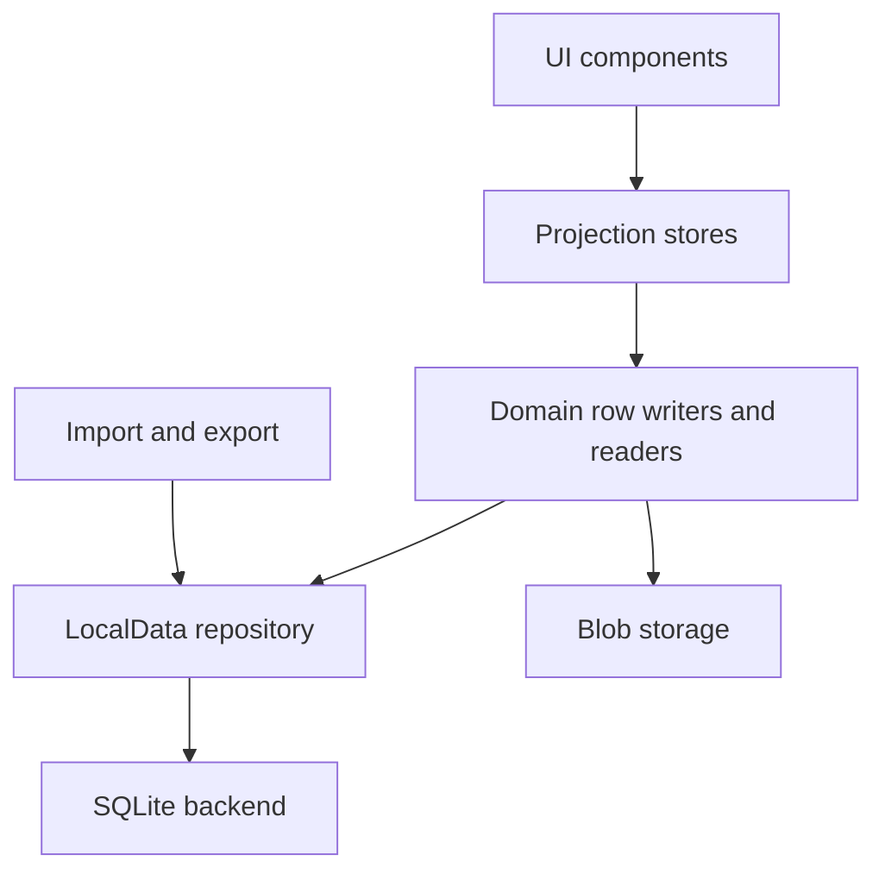

# Data And Storage Intent

Polaris is moving toward a simple rule: durable facts belong in LocalData, large binaries belong in blob storage, and UI stores are projections.

This document explains the intended shape.

## The Target Model

## Terms

**Durable facts** are the data the product must not silently invent or lose: conversations, messages, project records, persona references, document bodies, asset metadata, runtime settings, and ownership pointers.

**Projections** are render-friendly or interaction-friendly views of durable facts. They may cache, sort, group, or summarize, but they should not become a hidden second database.

**Imported data** is user-controlled package data brought into the current repository through explicit import, migration, and validation boundaries.

## LocalData

LocalData is the app-level repository contract. Product modules should care about LocalData rows and domain ownership, not about the physical storage engine.

LocalData should own:

- row completeness
- deletion and tombstone semantics
- commit validation
- domain promotion
- import and migration boundaries
- failure states such as incomplete, unloaded, timed out, or deleted

LocalData should not own:

- UI layout
- provider networking
- model request construction
- native shell product behavior

## SQLite

SQLite is the intended default durable substrate.

The important design point is that SQLite sits behind LocalData. Store and UI code should not reach around the repository contract to query SQLite directly.

SQLite should keep related writes together:

- transactions should commit related rows together
- readback should prove what was actually written
- startup should choose one facts backend, not stitch together several ordinary sources

## Blob Storage

Large binaries and previews should not be forced into the same shape as structured rows.

The target split is:

- LocalData rows own asset/document metadata and references
- blob storage owns large binary payloads
- missing metadata and missing binary payloads are different failure states

## Import And Export

Package data should enter through named boundaries:

- import
- migration
- validation
- health diagnostics

After validation, data should be represented as current LocalData rows.

The practical rule is: imported data becomes current data through a visible process, not through hidden parallel sources. Export reads current facts back out; it does not resurrect retired stores.

Ordinary startup should not run automatic import or catalog-conversion passes. It should read the current repository path. Existing data conversion belongs to an explicit user-visible import or migration flow.

## Current Availability

The repository already contains LocalData and SQLite work. Public docs should keep the default storage path and platform verification status clear as that work is completed.

Do not describe a storage path as default until startup, save, import, and platform checks all prove that path.

The current per-platform fact source is:

- **Native (iOS/Android):** SQLite is the current LocalData source, installed at the startup
  composition root before any store hydrates or persists.
- **Web / self-host:** KV (IndexedDB) remains the current source. A browser SQLite/WASM backend is a
  deliberately deferred, separate decision; until then the browser stays KV-backed, and KV is the
  single current source there, never a second source beside SQLite.
- **Imported package data:** becomes current SQLite-backed rows only through explicit import,
  migration, validation, and restore. Ordinary startup never migrates or promotes old stores.

The native path is source-complete for open-source readiness: it is proven on the Node SQLite engine
in CI, Android has a real-device runtime proof, and iOS has a fresh-simulator runtime proof.
Physical iPhone runtime proof and visible health/census inspection belong to native-release
verification, not the source publication gate. For the full fallback decision, the role of each
backend in tests, and the exact release checks still owed, see [native SQLite runtime proof](native-sqlite-runtime-proof.md).

For the current domain-by-domain storage decisions, see
[data source decisions](data-source-decisions.md). That document records
which domains have guarded first-write activation, which older stores are inactive
import/migration inputs, and which pieces remain open.
