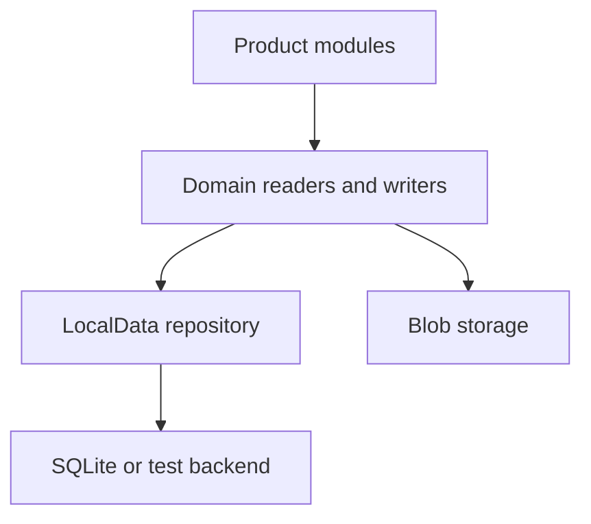

# Data Source Decisions

This document records the current public storage decisions in Polaris. It is a design-intent map,
not a release-channel claim.

Polaris uses a local-first data model where ordinary product reads and writes use current domain
facts, older storage formats are explicit import or migration evidence, and UI stores remain
projections instead of hidden databases.

## Core Rule

Durable product facts belong in LocalData domain rows, typed SQLite tables where indexed reads are
needed, and owned blob stores for large binary payloads.

Older stores are allowed only at named boundaries:

- import
- migration
- validation
- health and census diagnostics
- explicit recovery by id
- guarded inactive-domain reads before a safe first write exists

An ordinary product save should not silently replay an old catalog or make an old store
authoritative again.

## Active Source

LocalData separates two actions:

1. Commit domain rows and pointers.
2. Mark a domain as active through the active-data-source row.

That separation is deliberate. Import and migration can write candidate rows without making them
live. A first ordinary save can also write rows and then activate the domain, but only when doing so
cannot hide older user data.

The shared primitive for this direct activation shape is
`activateDomainsFromCommittedRows(...)`. It is for rows the product just wrote as current data. It
is not a migration validator.

## Domain Decisions

| Domain | Ordinary save shape | Older store status | Current decision |
| --- | --- | --- | --- |
| Chat | Current chat writer backed by LocalData rows | Older chat catalogs are import, export, migration, and recovery evidence only | Keep chat as its own model; do not force it into the store-domain activation template |
| Runtime | First-write activation | `runtime-providers-v2` is inactive migration evidence | Ordinary saves write current runtime rows |
| Space | First-write activation for full space state | `space-theme-state-v1` and older shell payloads are inactive migration evidence once active | Partial defensive writes are not the ordinary product path |
| Document | Guarded first-write activation | Legacy split body keys gate activation until explicit import/migration handles them | Loaded or staged bodies must persist; missing bodies stay incomplete |
| Asset | Guarded first-write activation for ordinary `saveAsset` | Blob stores remain the byte truth; older metadata stores are inactive evidence once active | Asset rows own metadata and owner facts; blobs own bytes |
| Persona | Guarded first-write activation for persona directory rows | `persona-state-v2` is inactive migration evidence once active | Persona owns collaborator rows; document owns memory bodies |
| Collection | First-write activation for collection directory rows | `collection-state-v2` is import, migration, and census evidence only once active | Collection owns project/card/file directories; document owns workspace bodies |

## Why Domains Differ

Runtime and space have compact state and no lazy body payload that can be stranded by activation.
They can activate from a normal save.

Document bodies are lazy and may still exist in older split/chunk stores. Activating the document
domain too early could make a current read stop before every old body has been represented as a
row, so document activation is guarded.

Assets split metadata from binary and preview bytes. LocalData rows own the metadata and owner
facts; blob stores own the bytes. Activation checks for preexisting asset entries before replacing
the ordinary write path.

Persona owns collaborator directory rows and the active-collaborator pointer. Persona memory bodies
belong to the document domain, so persona and document activation are judged separately.

Collection owns project, card, file, and workspace-document directory rows. Workspace document
bodies belong to the document domain, so collection can be active while body completeness remains a
document-domain concern.

Chat has a separate current-writer path. It already uses LocalData rows for current chat writes and
keeps older catalogs reachable only through explicit import, export, migration, diagnostics, and
recovery.

## Legacy Boundary

Old storage names may still appear in source code. Their presence alone does not mean the old layer
is an ordinary source of truth.

An old store is acceptable when it is read or written only by a named boundary:

- structured import
- migration staging
- export rehearsal
- health or census diagnostics
- explicit recovery by id
- inactive-domain bootstrap reads that are still guarded

It is not acceptable for ordinary startup or ordinary save code to quietly merge old catalogs into
current product truth once a domain has a repository-first path.

## SQLite Position

SQLite is the intended durable backend, but product modules should not query SQLite directly.

The public claim should remain precise:

- LocalData is the product-facing facts contract.
- SQLite sits behind LocalData.
- Blob storage remains appropriate for large binary payloads.
- A backend is not a release-channel default until startup, save, import, and platform checks prove
  that path.

## Verification Standard

A storage slice is complete only when it has both source shape and proof:

- the ordinary read/write path matches the intended boundary
- old stores are either outside the ordinary path or explicitly guarded
- focused tests cover fresh install, old install, active-domain behavior, and import/migration
  non-scope when relevant
- `npm run typecheck`, `npm run test:data-boundary`, and the full test suite are green for code
  slices

Documentation may describe an open item, but it must not quietly promote that item into a completed
architecture claim.
