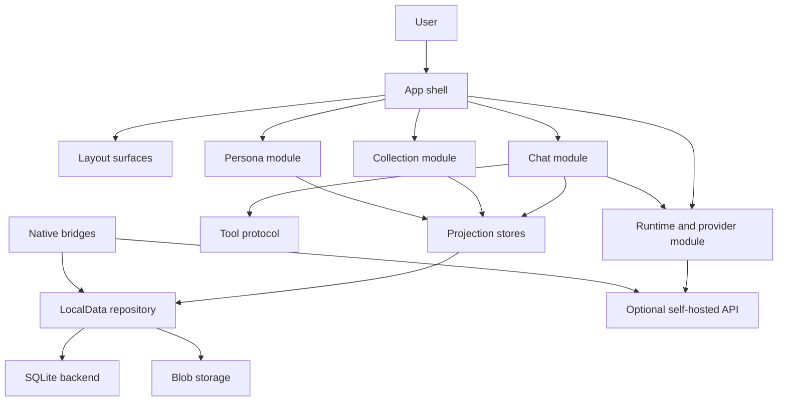

# 架构概览

Polaris 围绕共享产品运行时代码、明确存储所有权、可选后端能力和薄平台壳组织。核心问题不是「这个东西出现在哪个屏幕」，而是「哪个责任拥有这个事实或行为」。

## 高层形状

## 主要运行区域

| 区域 | 主要路径 | 责任 |
| --- | --- | --- |
| App shell | `src/ui/AppShell.tsx`, `src/app/shell/`, `src/ui/app-shell/` | 首屏、顶层导航、全局 sheet、应用级状态面 |
| Layout surfaces | `src/app/shell/appLayoutSurface.ts`, `src/ui/app-shell/useAppLayoutSurface.ts`, `src/app/bootstrap/appLayoutSurfaceBootstrap.ts` | phone/tablet/desktop 排布、sidebar 条件、布局 bootstrap 事实 |
| Chat | `src/ui/worlds/ChatWorld.tsx`, `src/app/chat/`, `src/engines/chat-api/` | 对话生命周期、请求生命周期、工具生命周期、上下文使用、消息展示 |
| Collection | `src/ui/worlds/CollectionWorld.tsx`, `src/app/collection/` | 保存卡片、资产、项目工作区、导入导出面 |
| Persona | `src/app/persona/`, `src/config/persona/personaBuilder.ts` | 协作者身份、persona 设置、长期 reference heads |
| Runtime/provider | `src/engines/provider-runtime/`, `src/engines/request/` | provider profile、模型能力、直连/relay/native transport |
| Tool protocol | `src/engines/tool-protocol/` | 模型可见 schema、解析、执行、结果投影 |
| LocalData | `src/engines/localData/` | 持久应用事实、row state、commit validation、import/promotion invariant |
| Stores | `src/stores/` | space/chat/collection/persona/runtime 的 UI/runtime 投影 |
| Server/selfhost | `api/`, `server/`, `workers/polaris-api/` | 可选 API route、relay validator、Worker gateway、origin policy |
| Native bridges | `ios/`, `android/`, `src/native/` | 平台能力，不拥有共享产品语义 |

## 依赖方向

优先方向是：

1. 产品模块通过 domain contract 读写。
2. Domain contract 用 LocalData 存持久事实。
3. LocalData 选择 SQLite 或测试/staging backend。
4. UI store 把当前状态投影给渲染和交互。
5. Layout surface 排列共享 runtime，但不变成 release channel。
6. 平台壳暴露能力，不拥有共享产品含义。

不要反过来。例如原生桥不应该决定 chat 语义，UI 组件也不应该决定迁移事实。

## 布局轴和平台轴

`phone`、`tablet`、`desktop` 是布局面。`web`、`iOS`、`Android` 和 desktop host 是平台/运行时事实。Web selfhost、Android APK、iOS/TestFlight 是发布状态。

iPad 是 iOS native capability 加 tablet layout surface。Mac host build 是 desktop host capability 加 layout surface。

## 五个投影 store

Polaris 保留五个顶层 client store：

- `spaceStore`
- `chatStore`
- `collectionStore`
- `personaStore`
- `runtimeStore`

这些 store 是投影和编排面。持久事实应该通过 LocalData row、blob storage 或其他文档化存储边界表达。

## 后端独立性

前端通过明确 origin 规则解析 `/api/...` 路由。部署者可以使用 same-origin API route，或配置自己的 `VITE_POLARIS_API_ORIGIN`。

后端 route 是能力面。当前源码里 `api/` 是具体 serverless handler，`workers/polaris-api/` 是较小的 Worker gateway，`server/` 当前保存 shared relay-target validators。

## 发布边界

这个仓库可以在任何 release channel 分发前先完成本地验证。Source、Web selfhost、Android APK、iOS/TestFlight、App Store 状态必须分别报告。
