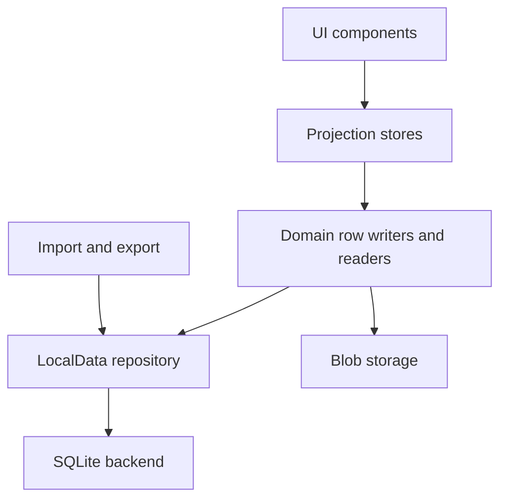

# 数据与存储意图

Polaris 正在收敛到一个简单规则：持久事实属于 LocalData，大型二进制属于 blob storage，UI store 是投影。

## 目标模型

## 术语

**持久事实** 是产品不能静默发明或丢失的数据：conversation、message、project record、persona reference、document body、asset metadata、runtime setting 和 ownership pointer。

**投影** 是为了渲染或交互友好的事实视图。它们可以缓存、排序、分组或摘要，但不应该成为隐藏的第二数据库。

**导入数据** 是用户控制的 package data，通过显式 import、migration、validation 边界进入当前 repository。

## LocalData

LocalData 是应用级 repository contract。产品模块应该关心 LocalData row 和 domain ownership，而不是物理存储引擎。

LocalData 应该负责：

- row completeness
- deletion 和 tombstone semantics
- commit validation
- domain promotion
- import/migration boundary
- incomplete、unloaded、timed out、deleted 等失败状态

LocalData 不应该负责 UI layout、provider networking、model request construction 或 native shell product behavior。

## SQLite

SQLite 是默认持久底座。关键点是 SQLite 在 LocalData 后面；store 和 UI code 不应该绕过 repository contract 直接 query SQLite。

SQLite 应该把相关写入放在一起：transaction 一起提交相关 row，readback 证明实际写了什么，startup 选择一个 facts backend，而不是把多个 ordinary source 缝在一起。

## Blob Storage

大型二进制和 preview 不应该被迫塞进结构化 row 的形状。

目标拆分是：

- LocalData row 拥有 asset/document metadata 和 reference
- blob storage 拥有大型 binary payload
- metadata 缺失和 binary payload 缺失是不同失败状态

## Import And Export

Package data 应该通过命名边界进入：

- import
- migration
- validation
- health diagnostics

验证后，数据应该表现为当前 LocalData rows。导入数据通过可见过程变成当前数据，而不是通过隐藏 parallel source 参与 ordinary startup。Export 读取当前事实，不复活退休 store。

普通启动不应该运行自动 import 或 catalog-conversion pass；它应该读取当前 repository path。旧数据转换属于用户可见的 import 或 migration flow。

## 当前可用性

当前平台事实源：

- **Native (iOS/Android):** SQLite 是当前 LocalData source，在任何 store hydrate/persist 前由 startup composition root 安装。
- **Web / self-host:** KV (IndexedDB) 仍是当前 source。浏览器 SQLite/WASM backend 是单独推迟的决定。
- **Imported package data:** 只通过显式 import、migration、validation、restore 变成当前 SQLite-backed rows。普通启动不迁移或 promote 旧 store。

Native path 的 source publication proof 包括：CI 的 Node SQLite engine、Android 真机 runtime proof、iOS simulator runtime proof。实体 iPhone 运行和可见 health/census 检查属于 native-release verification 矩阵。

完整细节见英文正本：

- [Native SQLite runtime proof](../native-sqlite-runtime-proof.md)
- [Data source decisions](../data-source-decisions.md)
